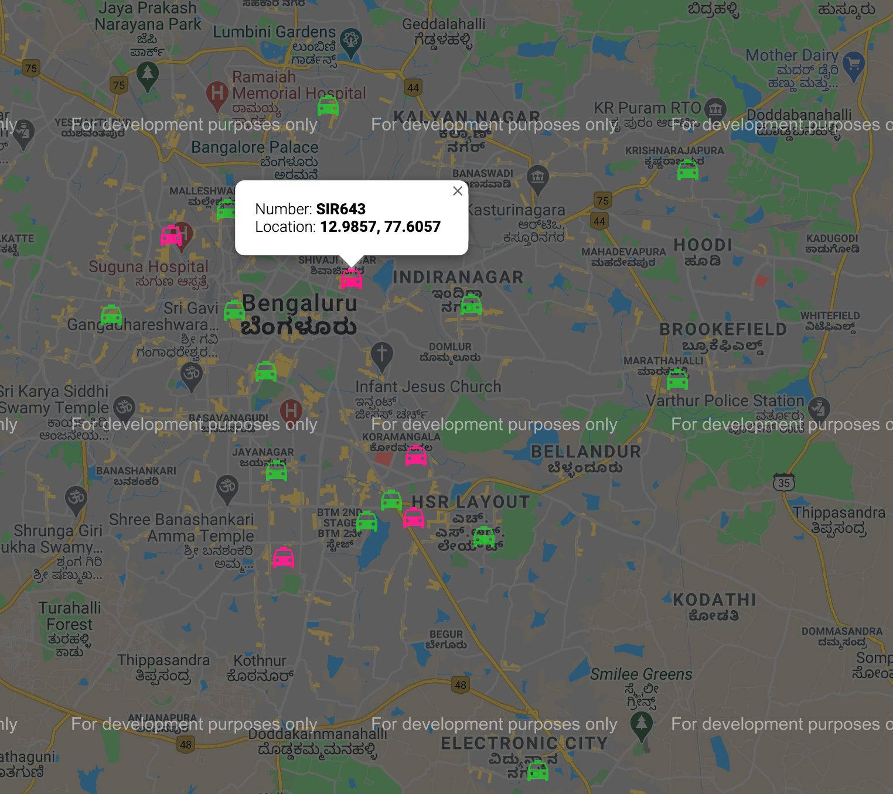
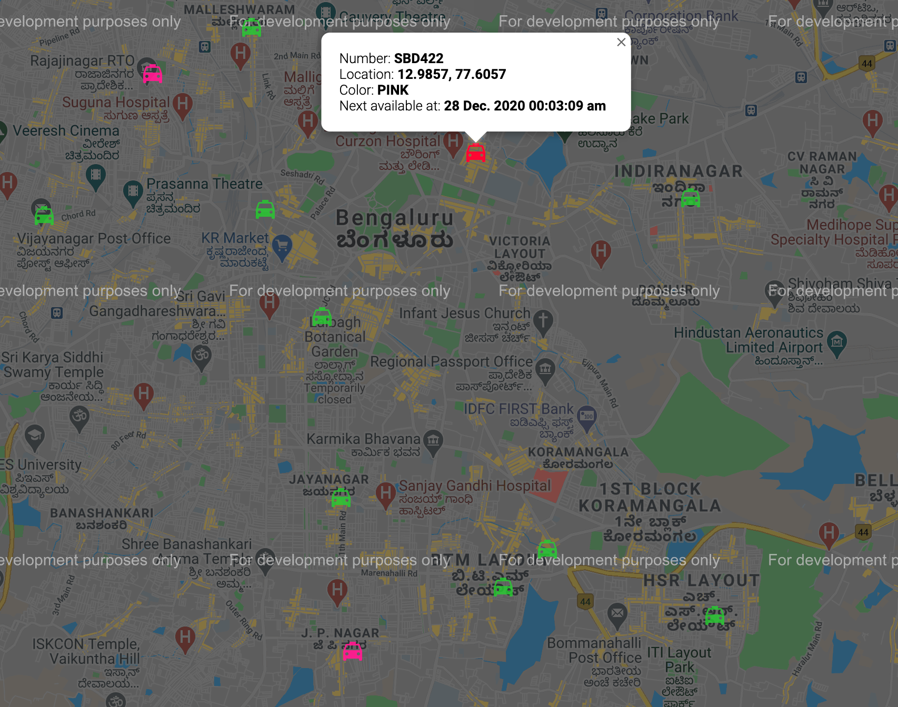

# Taxi hailing app: Fuber
Solution to Fuber is written in java. Gradle is used as build tool.
Spring Boot framework is used only to create HTTP end points

### Code style
- Solution follows object oriented programming principles
- Solution is developed in Test Driven Development approach.

### Design choices
- `Fleet` class has List of `Car` whose responsibility to get a suitable `Car` matching given filter criteria
- `CarComparator` a custom comparator is created to sort cars by distance to given latitude and longitude,
  this allows to find the nearest car to pickup location
- To find distance between two between `Location` coordinates, a formula is used to find nautical distace between coordinates
- `Car` class has a variable nextAvailableAt, those are being updated everytime a `Trip` is being created 
  this allows that particular Car to be excluded for `Trip` until the nextAvailableAt is after current time
- `TripPlan` class acts as an orchestrator to get `CustomerRequest` create `Trip` object, if `Car` is available for given filter criteria
- `Color` is created as an enum this allows new set of colors, and it's respective additional charges can be added without having to alter any other classes   
- Every`Car` is _assumed_ to travel at 60KmPh
- Every`Trp` is being added `TripLog` after it gets created

### To run the tests

```
./gradlew test
```

### To start the application
This should start the application in port 8080

```
./gradlew bootRun
```

## REST EndPoints
### Booking a Taxi
To create a booking 
```http request
POST /booking
```
Content type should be 
```
Content-Type: application/json
```
Body of the POST request should be of below format
```json
{
    "currentLocation": {
           "latitude": 12.9817,
        "longitude": 78.6284
    },
    "dropLocation": {
        "latitude": 12.9857,
        "longitude": 77.6057
    },
    "colorPreference": "PINK",
    "bookingTime": "2021-01-27T17:47:09.597"
}
```
The response, if successful
```http
HTTP 201 Created

{
    "car": {
        "plateNumber": "WFD6",
        "color": "PINK",
        "startPoint": {
            "latitude": 12.9698,
            "longitude": 77.75
        }
    },
    "pickUpLocation": {
        "latitude": 12.9817,
        "longitude": 78.6284
    },
    "dropLocation": {
        "latitude": 12.9857,
        "longitude": 77.6057
    },
    "bookedAt": "2020-12-27T19:47:09.597",
    "pickupAt": "2020-12-27T21:22:09.597",
    "reachesDestinationAt": "2020-12-27T23:12:09.597",
    "charge": "620 dogecoins"
}
```

The response, if failure
```http
HTTP 200 OK
{
    "message": "We are out of Taxis at this moment, Can you please try again!"
}
```

### List Cars
To get list of all the cars with details
```http request
GET /cars
```
The response
```http request
HTTP 200 OK

[
    {
        "plateNumber": "INR956",
        "color": "OTHERS",
        "currentLocation": {
            "latitude": 12.9784,
            "longitude": 77.6408
        },
        "available": true,
        "nextAvailableAt": "27 Dec. 2020 17:36:46 pm"
    },
    {
        "plateNumber": "KAA1515",
        "color": "PINK",
        "currentLocation": {
            "latitude": 12.9352,
            "longitude": 77.6245
        },
        "available": true,
        "nextAvailableAt": "27 Dec. 2020 17:36:46 pm"
    }
]
```

### UI
Fuber backend should be started for the UI work properly
All cars available:
- PINK Cars are denoted  by ping icon  
- Other Cars are denoted by Green
  

One of the cars is booked:
- Booked Cars are denoted by red color
- Booked Cars shows next available time on infowindow
  
